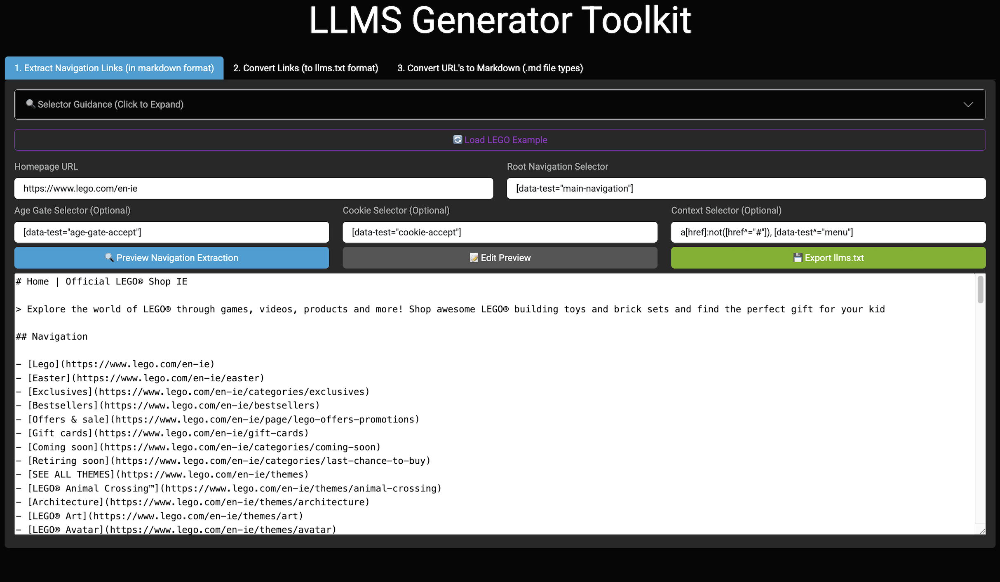

# LLMS Generator Toolkit 🤖

⚡ Convert Websites into High-Quality Training Data for LLMs & AI-First SEO
Build optimized llms.txt files and clean Markdown datasets from real website content — perfect for LLM pipelines, AI-ready sitemaps, and content-aware SEO.


### Main Features

1. **Navigation Extraction**: Scrape and extract navigation elements from websites using customizable CSS selectors to generate a llms.txt preview that you can edit to further optimize before downloading
2. **Link Conversion**: Transform links in various formats (Markdown, HTML, raw URLs) into a standardized format
3. **URL to Markdown**: Process URLs to extract key content and convert it to Markdown format

## Why Use This Toolkit?

- 🧠 Create better training datasets for custom LLMs and retrieval-augmented generation (RAG) systems
- 🔍 Make your content more accessible to generative search engines and AI assistants
- 🛠️ Quickly generate structured Markdown from live websites — no manual cleanup
- 📁 Design AI-first sitemaps (`llms.txt`) to guide crawlers and reduce hallucination

## Who This Is For

- SEO professionals building `llms.txt` files for AI search engines
- AI engineers preparing website-derived training datasets
- Product teams designing AI-friendly site structures
- Anyone exploring the intersection of SEO and LLMs

## Live Demo

Try it here → [llms-generator-toolkit.onrender.com](https://llms-generator-toolkit.onrender.com/) 

### Suggested Use Cases to Try:
- Generate a semantic site map from any homepage navigation
- Convert links into AI-readable Markdown
- Extract clean Markdown from product/category/landing pages

**Note:** The demo is hosted on Render's free tier plan, so the navigation extraction feature may be slow to respond. This is due to free tier limitations rather than issues with the application itself. For faster performance, consider running the application locally.

## 🔧 Tech Highlights

- Built with [Dash](https://dash.plotly.com) for reactive Python UI
- Uses [Playwright](https://playwright.dev/python/) to scrape dynamic websites
- HTML parsing via BeautifulSoup + semantic Markdown generation
- Runs on [Render](https://render.com) with Chromium sandboxing enabled

## Installation

### Prerequisites

- Python 3.7+
- pip package manager

### Setup

1. Clone this repository:
   ```bash
   git clone https://github.com/yourusername/llms-generator-tool.git
   cd llms-generator-tool
   ```

2. Create and activate a virtual environment (recommended):
   ```bash
   python -m venv venv
   source venv/bin/activate  # On Windows: venv\Scripts\activate
   ```

3. Install the required dependencies:
   ```bash
   pip install dash dash-bootstrap-components requests beautifulsoup4 playwright html2markdown diskcache nest-asyncio
   ```

4. Install Playwright browsers:
   ```bash
   python -m playwright install chromium
   ```

## Usage

1. Start the application:
   ```bash
   python app.py
   ```

2. Open your web browser and navigate to `http://127.0.0.1:8050`

### Navigation Extraction

Extract the navigation structure from a website:

1. Enter the homepage URL (e.g., `https://www.lego.com/en-ie`)
2. Specify the root navigation selector (e.g., `nav[data-test="main-navigation"]`)
3. Optionally, provide a context selector to refine link extraction
4. Click "Extract Navigation"
5. View the Markdown-formatted navigation structure
6. Further customize/edit the generated markdown
7. Download the result as `llms.txt`

### Link Conversion

Convert links from various formats to a standardized format:

1. Paste Markdown links, HTML links, or raw URLs in the input area
2. Click "Convert Links"
3. The converted links will appear in standardized Markdown format
4. Copy and use the converted links as needed

### URL to Markdown

Process URLs to extract key content in Markdown format:

1. Enter one or more URLs (one per line) in the input area
2. Click "Convert URLs"
3. View the extracted Markdown content for each URL
4. Download the results as individual Markdown files or a ZIP archive

## Search Optimization Benefits

### LLMs.txt for AI Crawlers and Search

The `llms.txt` file generated by this tool serves as a guide for AI-based crawlers and large language models, similar to how `robots.txt` guides traditional web crawlers. Implementing an `llms.txt` file offers several benefits:

1. **Enhanced AI Discoverability**: Help AI systems better understand your site structure and important content
2. **Improved Content Representation**: Ensure AI models accurately represent your website's content in search results and responses
3. **Training Data Optimization**: Guide LLMs on which content to prioritize for training and responses
4. **Reduced Hallucination Risk**: Provide structured, accurate data to reduce the risk of AI models generating incorrect information about your site
5. **Better Resource Allocation**: Indicate which parts of your site are most relevant for AI training and responses

### Customizing Your llms.txt Output

The tool allows you to customize the `llms.txt` output to optimize for specific AI models and search algorithms:

1. **Content Prioritization**: Order your navigation links by importance to guide AI crawlers to your most valuable content first
2. **Content Categorization**: Group similar content together with headings and subheadings
3. **Content Annotation**: Add brief descriptions to links to provide additional context
4. **Depth Control**: Determine how deep AI models should crawl into your site hierarchy
5. **Expanded Metadata**: Include additional metadata about page content, update frequency, or content authority

Example of a customized `llms.txt` section:

```markdown
## Product Categories (High Priority)
- [Sustainable Products](/sustainable-products) - Our eco-friendly product line with carbon-neutral manufacturing
- [Bestsellers](/bestsellers) - Most popular products based on customer reviews and sales

## Knowledge Base (Medium Priority)
- [Tutorials](/tutorials) - Step-by-step guides for product usage
- [FAQs](/faqs) - Frequently asked questions about our products and services
```

## Implementing llms.txt on Your Website

### What is llms.txt?

The `llms.txt` file is an emerging standard for providing structured guidance to large language models about your website content. You can learn more about the standard at [https://llmstxt.org/](https://llmstxt.org/).

### Setting Up llms.txt

1. **Generate the file**: Use this tool to extract your site's navigation and generate the base `llms.txt` file
2. **Customize the output**: Edit the file to prioritize important content and add context
3. **Create an expanded version**: Consider creating an `llms-full.txt` file with more comprehensive site mapping
4. **Place the file on your server**: Upload the file to your website's root directory (e.g., `https://example.com/llms.txt`)

### Reference in robots.txt

Add a reference to your `llms.txt` file in your `robots.txt` file:

```
# Standard robots directives
User-agent: *
Allow: /

# LLM guidance
LLM: https://example.com/llms.txt
LLM-full: https://example.com/llms-full.txt
```

### Reference Markdown Files

For more detailed content guidance, you can reference individual Markdown files in your `llms.txt` or `llms-full.txt`:

```markdown
# Company Overview
- [About Us](/about) - Learn about our company history and mission
  - Detailed content: [about-us-detailed.md](/content/about-us-detailed.md)
  
# Product Information
- [Product Catalog](/products) - Browse our complete product lineup
  - Technical specifications: [product-specs.md](/content/product-specs.md)
```

### Structured Data Integration

For optimal results, combine your `llms.txt` implementation with structured data markup (JSON-LD, Schema.org) on your web pages to provide consistent signals to both traditional search engines and AI systems.

## Responsible Web Scraping

### Respecting robots.txt

This tool accesses web content and extracts data from websites. When using this tool, please ensure you respect each website's terms of service and `robots.txt` directives:

1. **Check robots.txt first**: Before scraping any website, check its `/robots.txt` file (e.g., `https://example.com/robots.txt`) to see if the site owner has specified any crawling restrictions.

2. **Honor disallow directives**: Do not scrape pages or sections that are explicitly disallowed in the robots.txt file.

3. **Implement rate limiting**: To avoid overwhelming servers, consider implementing additional rate limiting when extracting data from multiple pages of the same domain.

4. **Identify your scraper**: Consider modifying the user agent to identify your scraper and provide contact information.

Example of adding robots.txt compliance to the code:

```python
import requests
from urllib.robotparser import RobotFileParser

def is_allowed(url, user_agent="MyScraperBot"):
    rp = RobotFileParser()
    parsed_url = urlparse(url)
    robots_url = f"{parsed_url.scheme}://{parsed_url.netloc}/robots.txt"
    
    try:
        rp.set_url(robots_url)
        rp.read()
        return rp.can_fetch(user_agent, url)
    except:
        # If robots.txt doesn't exist or can't be parsed, proceed with caution
        return True

# Use this function before scraping any URL
if is_allowed(url_to_scrape):
    # Proceed with scraping
else:
    # Skip this URL or notify the user
```

### Legal and Ethical Considerations

- This tool should only be used to extract publicly available information
- Do not use this tool to bypass paywalls, login requirements, or access restricted content
- Consider the load your scraping puts on the target websites, especially smaller sites
- When in doubt, contact the website owner for permission

## Troubleshooting

### macOS Fork Safety Error

If you encounter an error related to fork safety on macOS:

```
objc[...]: +[__NSCFConstantString initialize] may have been in progress in another thread when fork() was called.
```

This is addressed in the code with:

```python
os.environ['OBJC_DISABLE_INITIALIZE_FORK_SAFETY'] = 'YES'
```

Ensure this line appears at the very top of your script, before any imports.

### Alternative Solutions:

1. Use the `if __name__ == '__main__'` guard:
   ```python
   if __name__ == '__main__':
       os.environ['OBJC_DISABLE_INITIALIZE_FORK_SAFETY'] = 'YES'
       app.run(debug=True)
   ```

2. Change the multiprocessing start method:
   ```python
   import multiprocessing
   multiprocessing.set_start_method('spawn')  # Use 'spawn' instead of 'fork'
   ```

## Advanced Configuration

### Customizing Navigation Extraction

- **Root Navigation Selector**: Specify the CSS selector for the primary navigation element
- **Context Selector**: Define which clickable elements should be considered in the navigation tree
- **Dynamic Content Handling**: The tool supports dynamic websites built with React, Vue, Angular, and other frameworks

### Optimizing Markdown Output

The URL to Markdown feature extracts:
- Page title and meta description
- Key headings (H1, H2, H3)
- First few paragraphs of main content
- Structured content formatted for LLM consumption

## Contributing

Contributions are welcome! Please feel free to submit a Pull Request.

## License

This project is licensed under the MIT License - see the LICENSE file for details.
